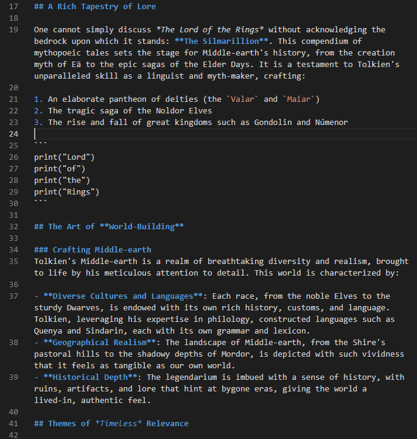
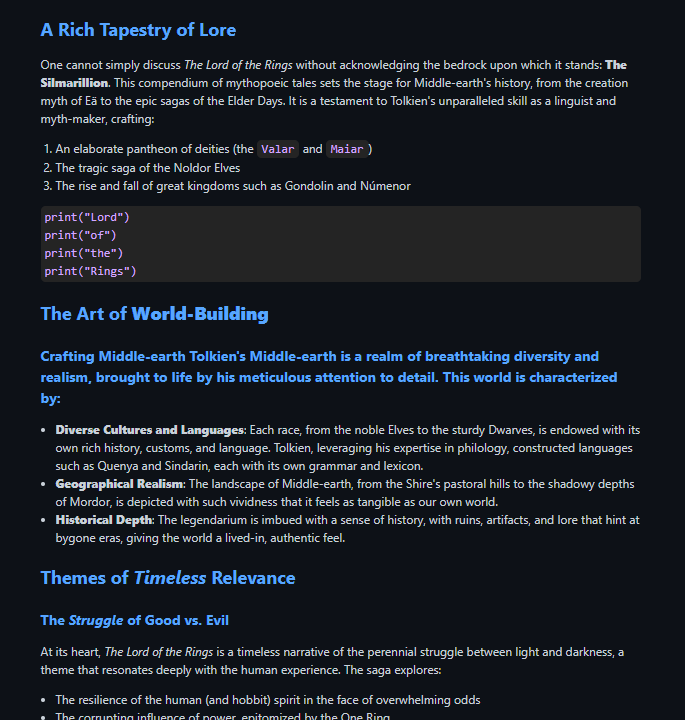

# staticSiteGenerator

A Python program that converts markdown documents into a static HTML site.

## Instructions

To run this application:

- Place relevant markdown documents in the "content" directory
- Place any linked images or other materials in the "static" directory
- Place a css file in the "static" directory to adjust formatting of the html site
- Run the './main.sh' script to convert all markdown materials in the content directory into html
- Visit the http://localhost:8888 address to view the site

## Example

